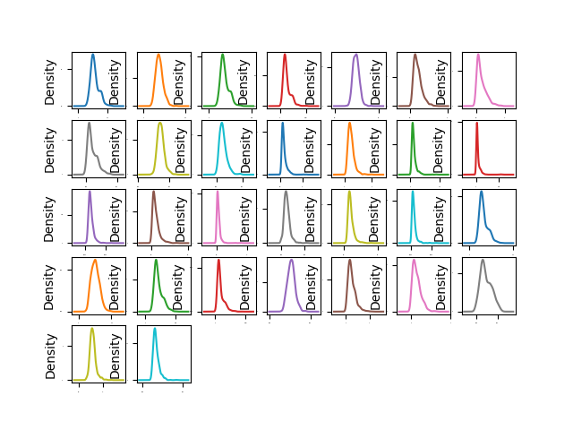
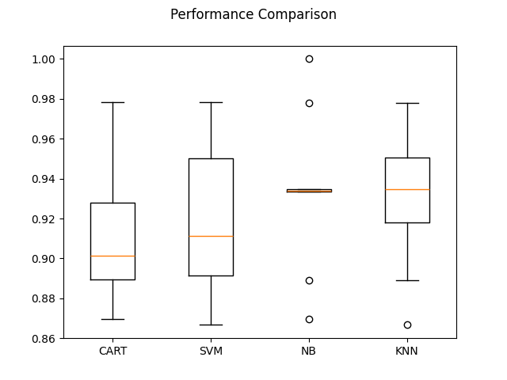
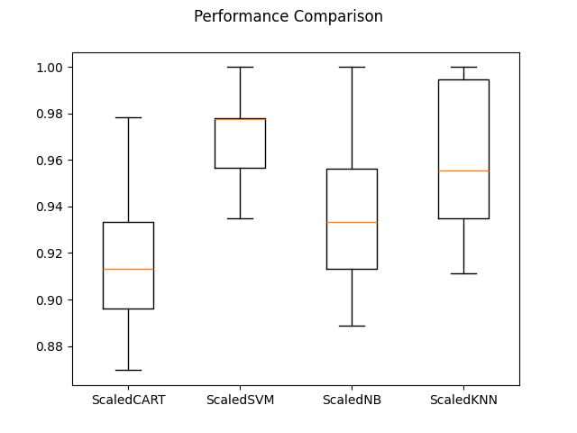
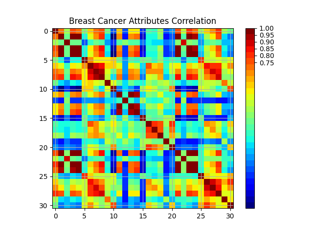

# Breast Cancer Prediction Using KNN and Cross-Validation

## Overview
This project aims to predict breast cancer outcomes using the K-Nearest Neighbors (KNN) algorithm and evaluate the model's performance using cross-validation. The project utilizes a dataset containing features related to breast cancer and applies various data science techniques to build and validate a predictive model.

## Project Structure

├── .gitattributes <br/>
├── README.md <br/>
├── Figure_1.png <br/>
├── Figure_2.png <br/>
├── Figure_3.png <br/>
├── bc at correlation.png <br/>
├── bcprediction.py <br/>
└── data.csv <br/>


### Files and Directories

- **.gitattributes**: Git configuration file for managing repository attributes.
- **README.md**: This file. Provides an overview and instructions for the project.
- **Figure_1.png**: Visualization Of breast cancer data densities.
- **Figure_2.png**: Visualization of comparision to cross-validation.
- **Figure_3.png**: Additional visualization of comparison.
- **bc at correlation.png**: Visualization showing correlations in the dataset.
- **bcprediction.py**: Python script containing the code for loading the dataset, training the KNN model, and performing cross-validation.
- **data.csv**: CSV file containing the dataset used for training and testing the model.

## Getting Started

### Prerequisites
To run this project, you need Python 3.7 or later and the following Python libraries:
- `pandas`
- `numpy`
- `scikit-learn`
- `matplotlib`
- `seaborn` (optional, for enhanced visualization)

Install the required libraries using pip:
```bash
pip install pandas numpy scikit-learn matplotlib seaborn
```
Running the Code
* Clone the repository to your local machine:
```bash
git clone https://github.com/alinanjum1999/Breast-Cancer-using-KNN-and-Cross-Validation.git
cd Breast-Cancer-using-KNN-and-Cross-Validation
```
* Ensure that data.csv is in the project directory.
* Run the bcprediction.py script to execute the analysis

```bash
python bcprediction.py
```
### Visualizations
#### The following figures are included in the project:

* Figure_1.png: <br/>
  
* Figure_2.png:<br/>
  
* Figure_3.png: <br/>
  
* bc at correlation.png: <br/>
  

### This script performs the following tasks:

* Loads the dataset from data.csv.
* Preprocesses the data, including feature scaling and splitting into training and testing sets.
* Trains a K-Nearest Neighbors model.
* Evaluates the model using cross-validation.
* Generates and saves visualizations of the results.
* data.csv - The dataset file contains features related to breast cancer diagnoses, with columns representing various measurements and the target variable indicating the diagnosis.

### Contributing
Contributions are welcome! Please fork the repository and create a pull request with your changes.

### License
This project is licensed under the MIT License - see the LICENSE file for details.

### Acknowledgements
The dataset used in this project is sourced from the UCI Machine Learning Repository or similar datasets.
Libraries and tools used in the project include scikit-learn, pandas, numpy, matplotlib, and seaborn.
### Contact
For any questions or issues, please contact alinanjum1999@gmail.com.


